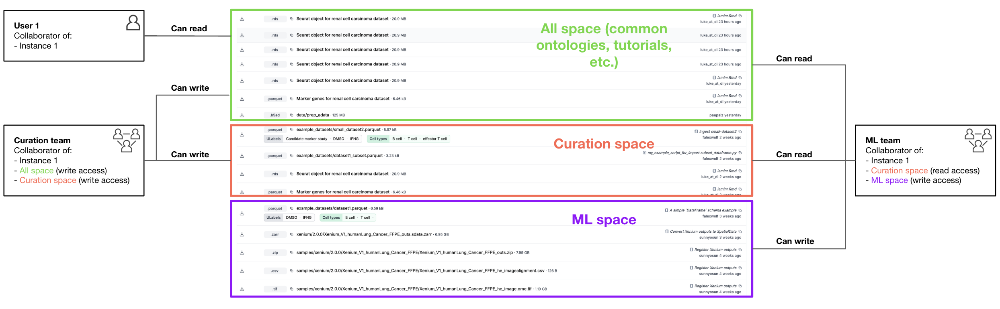
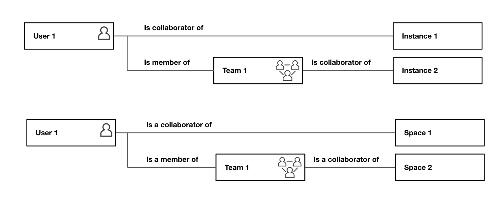

# Access management

This document outlines the access control system, detailing its architecture, key features, roles, and implementation guidelines.

## System architecture

Our access management is built on a four-tier hierarchy, providing granular control over resources:

1.  **Organizations:** The top-level entity. Contains all associated teams, instances, and spaces. Acts as the primary boundary for users and resources.
2.  **Teams:** Groups of users within an organization. Roles and permissions can be assigned collectively to teams, simplifying management.
3.  **Instances:** Collaborative workspaces (e.g., projects, environments) within an organization. Each instance has its own permission structure and collaborators.
4.  **Spaces:** Fine-grained access control areas *within* instances. Allow specific permissions to be set on subsets of data or resources within an instance (e.g., datasets, models, notebooks).

## Key features

### Spaces

Spaces are areas within instances that allow specific permissions to be set on subsets of data for organization resources by department, project, or sensitivity level:
* Each space has its own set of collaborators with their roles and permissions, independent of instance-level roles. 
* Users must be both instance collaborators AND space collaborators to access resources in a space within an instance
* Spaces must be attached to an instance before records from that instance can be assigned to the space (you need both instance and space admin permissions to create this attachment)
* Spaces are applied at the database record level, and a record can only belong to one space

  

### All space

*   **Default "All" space:** Every instance includes a default `"All"` space upon creation. This space typically holds common, non-sensitive resources.
*   **Read access:** All collaborators added to an instance automatically receive read access to the default `"All"` space.
*   **Write access:** Collaborators granted write or admin permissions at the instance level automatically receive write access to the default `"All"` space.

### Teams

Teams provide a way to manage permissions for groups of users for instances and spaces. 
Users can be collaborators either directly as individual users or through team membership.

  

### Seamless transition

*   All current users retain their existing instance collaborator roles and associated permissions.
*   Existing instance collaborators are automatically converted to organization members.

## Role definitions

### Organization roles

*   **Admins:** Have complete access and control over all resources within the organization, including managing teams, instances, spaces, and organization settings.
*   **Managers:** Can manage teams, instances, and spaces but may have limitations on modifying organization-level settings.
*   **Members:** Can be granted access to specific resources (teams, instances, spaces) based on assignments. Default access might be limited.
*   **Guests:** Intended for external collaborators with limited access, typically restricted to specific instances or spaces they are explicitly invited to.

### Team roles

*   **Admins:** Can add/remove team members, define member roles within the team context, and manage team resources or settings. Can typically perform any action a member can.
*   **Members:** Can access resources granted to the team (e.g., specific instances or spaces).

### Instance roles

*   **Admins:** Can add/remove collaborators from the instance, define collaborator roles within the instance, and manage instance settings. For data access, automatically receive write access to the default "All" space only.
*   **Read collaborators:** Automatically receive read access to the default "All" space only.
*   **Write collaborators:** Automatically receive write access to the default "All" space only.

**Note:** Permissions for spaces other than the default "All" space must be managed separately and independently of the instance collaborator role.

### Space roles

*   **Admins:** Have full control over the specific space, including managing permissions and content within that space.
*   **Read collaborators:** Can read data and view resources within that specific space across accessible instances.
*   **Write collaborators:** Can read, add, and modify data or resources within that specific space across accessible instances.

## Practical implementation example

A typical organization might structure its spaces within instances like this:

1.  **`"All"` dpace (default):**
    *   **Purpose:** Contains common assets like ontologies, tutorials, and non-sensitive datasets accessible to everyone within the instance.
    *   **Access:** Generally broad read access for instance collaborators.

2.  **`"Curation"` space:**
    *   **Purpose:** Stores sensitive curated data requiring stricter access control.
    *   **Access example:**
        *   `"Curation Team"` has write access.
        *   `"ML Team"` has read access.
        *   No access granted to other teams by default.

3.  **`"ML"` space:**
    *   **Purpose:** Contains machine learning models, development resources, and potentially experimental data.
    *   **Access example:**
        *   Only `"ML Team"` has access (read/write as needed).
        *   Completely isolated from other teams unless explicitly granted.

## Getting started guide

Follow these steps to configure your access control structure:

### 1. Set up your organization structure

*   Ensure you have access to your designated **organization** and verify that you or another user in your organization has sufficient organization permissions (organization admin role). Contact support if no one has the required permissions to properly set up your access control structure.
*   Create **teams** that reflect your working groups (e.g., research, clinical, data science, curation) and assign team admins.

### 2. Configure instances

*   Create or identify the **instances** required for your projects or environments.
*   Assign **instance admins** who will manage collaborators and roles for that specific instance.
*   Add **collaborators** (users or teams) to instances as needed. Remember they get default read access to the `"All"` space.

### 3. Create additional spaces for fine-grained access

*   Create **spaces** like `"curation"` or `"ML"` to segregate resources and control access more granularly and attach it to relevant instances.
*   Assign appropriate **space roles** (read, write, admin) to teams and/or individual users for each specific space.
